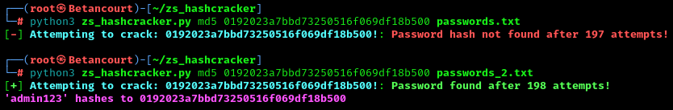

# Z3R0sec Hashcracker v1.0

A Python script for cracking hashed passwords using a wordlist. The script supports multiple hash types and support for wordlists.

## Features
- Supports multiple hash algorithms (MD5, SHA-1, SHA-256)
- Logs attempts in real-time.
- Option to specify your own wordlist.

## Requirements
- Python 3.6+
- Dependencies listed in `requirements.txt`.

## Installation
Clone the repository and install the requirements:
   ```bash
   git clone https://github.com/Z3R0-sec/zs_hashcracker.git
   cd zs_hashcracker
   pip install -r requirements.txt
   ```
***OR***

Copy and paste the script, install dependencies, and make a wordlist.

## Usage

```bash
python3 zs_hashcracker.py <hash_type> <hash_value> [wordlist]
```
- `<hash_type>`: The hash algorithm (e.g., md5, sha1, sha256, etc.).  
- `<hash_value>`: The hash you are attempting to crack.  
- `[wordlist]`: (Optional) The path to your wordlist file. Defaults to `passwords.txt`

## Example Usage
Below is a screenshot of the script in action:  



### Disclaimer
This script is for educational purposes only. Use responsibly and ensure you have authorization before attempting to crack passwords.
